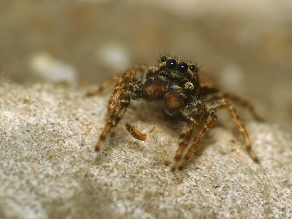

### Moje Ulubione Zwierzęta

 **zwierzemta są super**

 *bardzo je lubie*

 mam nadzieje że ty też ~~(chyba że nie)~~

 >"Miłość do zwierząt jest ściśle związana z dobrocią charakteru i można śmiało powiedzieć, że ci, którzy są okrutni wobec zwierząt, nie mogą być dobrymi ludźmi."
– Arthur Schopenhauer 

 MOJE TOP 3 ZWIERZĘTA

1. Pająki
	1. Zyzuś tłuścioch
	2. Pilniczek włochatek
	3. Rozciągnik mchuś
2. Wirki
3. Lancetniki
	- nie mają czaszek :O

```py
if 2 == 2:
	print("To prawda że kocham zwierzenta")
else:
	print("Nie kocham zwierzont :OO")
```

`print("Witaj Świecie Zwierząt")`


